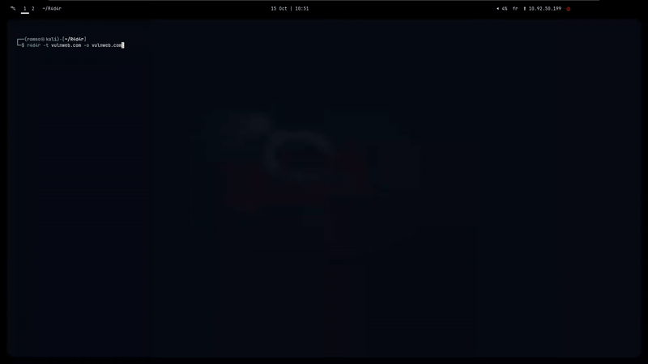

# R4D4R


**R4D4R** is a modular reconnaissance pipeline designed for bug bounty hunters and security researchers. It automates subdomain enumeration, vulnerability detection, and live asset analysis using a combination of Go and Python tools.



---

## Table of Contents

- [Features](#features)
- [Installation](#installation)
- [Usage](#usage)
- [Example Output](#example-output)
- [Output Structure](#output-structure)
- [Dependencies](#dependencies)
- [Contributing](#contributing)
- [Author](#author)
- [License](#license)

---

## Features

* Subdomain discovery using `subfinder` and `assetfinder`
* HTTP status and live site checks with `httpx`
* Vulnerable subdomain detection with `subzy`
* Broken link detection using `BLH (Broken-Link-Hijacker)`
* CORS issues checking with `Corsy`
* Logs and results stored in a structured output directory

---

## Installation

### Prerequisites

- Docker installed and running
- Python 3.11+ 
- Internet access for tool updates and domain resolution

### Installation Steps

```bash
git clone https://github.com/Romso94/R4d4r.git
cd R4d4r
docker build -t r4d4r .
```
---

## Optional: Create an Alias for Easier Usage

To simplify usage, you can create a temporary shell alias for `r4d4r`. This allows you to run the tool directly with `r4d4r -t example.com` instead of typing the full Docker command each time.

### Bash / Zsh

```bash
alias r4d4r='docker run --rm -it -v "$PWD:/data" r4d4r'
```

Then you can run:

```bash
$ r4d4r -t example.com 
or
$ r4d4r -t example.com -o /data/results
```

> ⚠️ Note: This alias is temporary and will be removed when you close the terminal. To make it permanent, add it to your `~/.bashrc` or `~/.zshrc`.

### Make the alias permanent

To keep the `r4d4r` alias across terminal sessions, add it to your shell configuration file.

- **For Bash** (append to `~/.bashrc`):

```bash
echo "alias r4d4r='docker run --rm -it -v \"$PWD:/data\" r4d4r'" >> ~/.bashrc
# Reload your shell config
source ~/.bashrc
```

- **For Zsh** (append to `~/.zshrc`):
```bash
echo "alias r4d4r='docker run --rm -it -v \"$PWD:/data\" r4d4r'" >> ~/.zshrc
# Reload your shell config
source ~/.zshrc
```
## Usage

```bash
docker run --rm -it -v "$PWD:/data" r4d4r r4d4r -t example.com -o /data/results
```

Main options:

* `-t`, `--target`: target domain (e.g., example.com)
* `-o`, `--outdir`: output directory for results
* `--timeout`: timeout per command (default: 120s)

---

## Example Output

```
[+] Starting subfinder + assetfinder
[DONE] Subfinder done (20 lines), Assetfinder done (18 lines)
[+] Running httpx (status + live)
[DONE] httpx tasks finished
[+] Starting subzy
[DONE] Subzy finished
...
```

* Messages are displayed in real-time in the ASCII dashboard.
* The radar visualizes the ongoing steps with animated blips.

---

## Output Structure

```
results/
├── domains.txt
├── status.txt
├── live.txt
├── Subzy/
│   ├── subzy.txt
│   └── subzy.err
├── BLH/
│   ├── blh.txt
│   └── blh.err
└── Corsy/
    ├── corsy.txt
    └── corsy.err
```

---

## Dependencies

- [Subfinder](https://github.com/projectdiscovery/subfinder)
- [Assetfinder](https://github.com/tomnomnom/assetfinder)
- [Httpx](https://github.com/projectdiscovery/httpx)
- [Subzy](https://github.com/LukaSikic/subzy)
- [Corsy](https://github.com/s0md3v/Corsy)
- [BLH (Broken-Link-Hijacker)](https://github.com/CyberCommands/Broken-Link-Hijacker) <!-- Replace with actual link -->

---

## Future

- Output files will be parsed and easier to read

## Contributing

Contributions are welcome! Feel free to open issues or submit pull requests to improve the pipeline, add new modules, or enhance the dashboard.

---


## Author

**Romso** — R4D4R is a personal project aimed at simplifying web reconnaissance and security.

---

## License

This project is licensed under the MIT License. See the [LICENSE](LICENSE) file for details.
